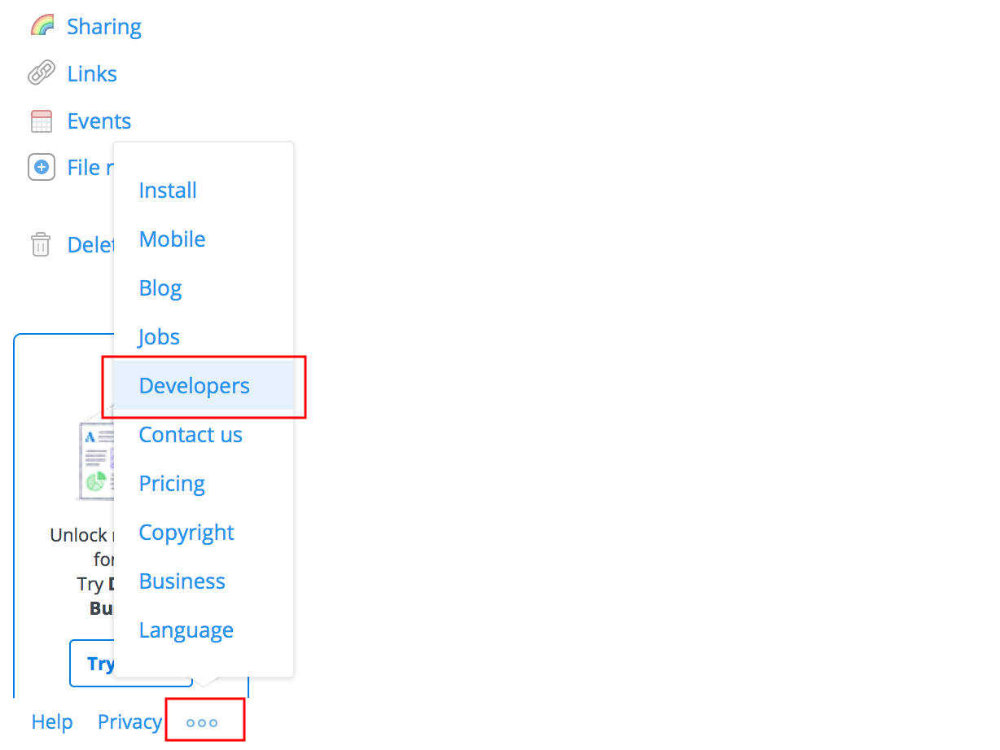
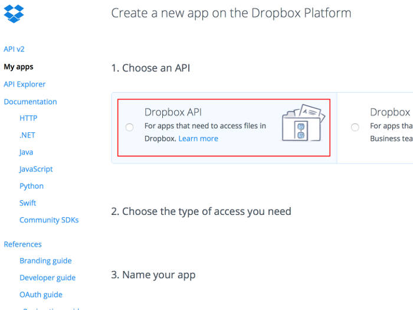
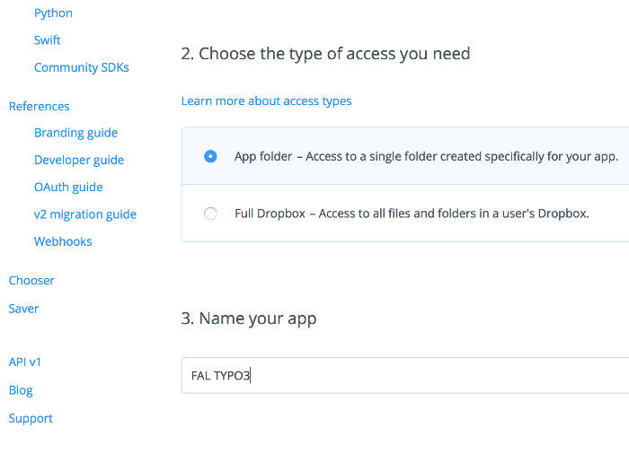
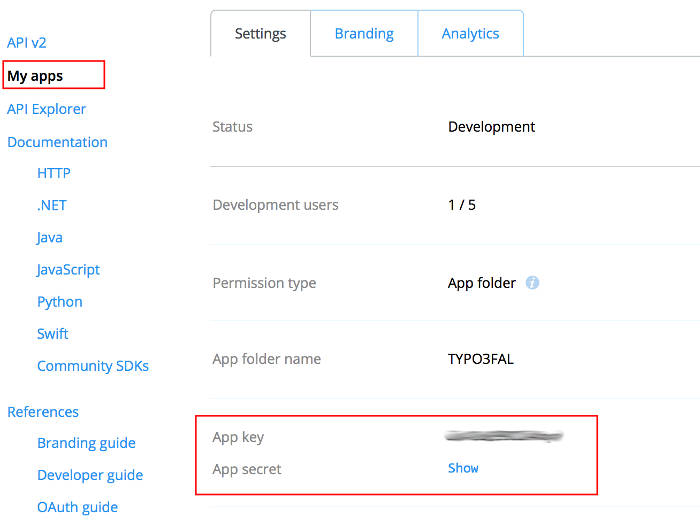
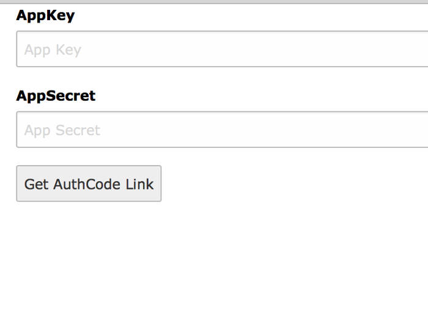
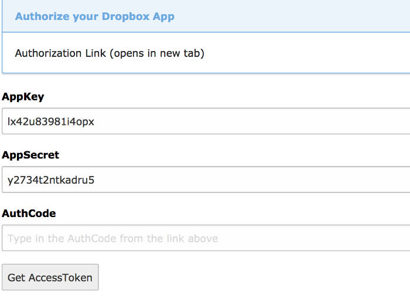
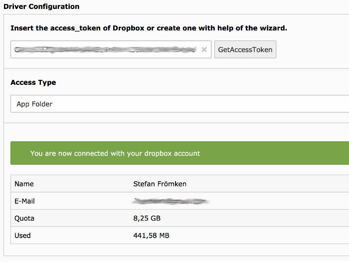

.. ==================================================
.. FOR YOUR INFORMATION
.. --------------------------------------------------
.. -*- coding: utf-8 -*- with BOM.

.. include:: ../../Includes.txt

Configuration
=============

Create File Storage
-------------------

* Go to list module and choose PID 0 (Rootpage with TYPO3 logo in front).
* Create a new record of type ``File Storage``
* On tab ``General`` choose a name like ``Dropbox``
* On tab ``Configuration`` you have to choose the ``Dropbox`` driver

Driver Configuration
--------------------

To communicate over the Dropbox-API you need an Access Token.

#. Create an App API at Dropbox.com
#. Copy ``App Key`` and ``App Secret``
#. Get Access Token from developer area of www.dropbox.com
   or you can create an access token with help of the wizard you can reach over ``GetAccessToken``
#. Save the record

Create API at dropbox.com
"""""""""""""""""""""""""

* Go to Developer area of dropbox.com

* Create new Dropbox App

.. figure:: ../../Images/AdministratorManual/dropbox_create_app.jpg
	:width: 500px
	:align: left
	:alt: Create Dropbox App

* **Step 1: Choose API** Choose ``Dropbox Api``

* **Step 2: Choose App type** I prefer to choose ``App folder``, so in case of a security
  break no one can access files outside of your App folder.

* **Step 3: Give it a name** There are some rules regarding the name.
  For example the word ``Dropbox`` can not be part of the name.

* Click on ``Create App``

* Copy ``App key`` and ``App secret`` and insert them into the wizard
  of the TYPO3 driver configuration.

Start Driver Wizard
"""""""""""""""""""

While editing the ``File storage`` click on ``GetAccessToken`` to start the wizard.
Paste in the ``App Key`` and ``App Secret`` from Dropbox App explained above.
Click on ``Get AuthCode Link``

On the next page you have to click on the ``authorization link`` which will open a new tab
where you have to give access to your Dropbox App.

Copy the AuthCode from Dropbox page into the AuthCode field of the Wizard.

With a click on ``Get AccessToken`` a further request to dropbox.com will start in the background.
On success the Access Token will automatically inserted in ``File Storage`` record and
the wizard will close.

Save the record. On success we show you some user data.

Performance
-----------

.. note::
   At the bottom of the ``Configuration`` tab you will find the
   option: ``Folder for manipulated and temporary images etc.``
   If you keep the default, all temporary images will be transferred over
   the Dropbox-API which is very slow.
   So it would be good to move that special folder to a folder on a
   fast ``file storage``. Set this to ``1:/_processed_/`` if your fileadmin
   file storage has the UID 1.
